## Overview
Every change follows the same workflow. No ad-hoc commits, no direct-to-main shortcuts.

<HARD-GATE>
Do NOT modify files before creating a branch.
</HARD-GATE>

## Contribution Checklist
- [ ] 1. Pull latest from `main`
- [ ] 2. Create a branch using `feat/`, `fix/`, or `chore/`
- [ ] 3. Make changes using TDD (`superpowers:test-driven-development` if available)
- [ ] 4. Commit with conventional commit format: `type(scope): message`
- [ ] 5. Push branch
- [ ] 6. Open PR using the PR template
- [ ] 7. Request review
- [ ] 8. Address feedback
- [ ] 9. Merge only when approved and CI passes

```dot
digraph contribution_flow {
  rankdir=LR;
  node [shape=box];
  sync [label="Pull latest main"];
  branch [label="Create feat|fix|chore branch"];
  tdd [label="Develop with TDD"];
  commit [label="Commit: type(scope): message"];
  push [label="Push branch"];
  pr [label="Open PR from template"];
  review [label="Request + receive review"];
  feedback [label="Address feedback"];
  ci [shape=diamond, label="Approved + CI green?"];
  merge [label="Merge"];

  sync -> branch -> tdd -> commit -> push -> pr -> review -> feedback -> ci;
  ci -> tdd [label="No"];
  ci -> merge [label="Yes"];
}
```

## Conventional Commit Types

| Type | Use case |
| --- | --- |
| `feat` | New functionality |
| `fix` | Bug fix |
| `chore` | Maintenance/non-feature work |
| `docs` | Documentation-only changes |
| `test` | Test additions/updates |
| `refactor` | Internal code restructure without behavior change |

## Common Rationalizations

| Rationalization | Why it's wrong | Correct action |
| --- | --- | --- |
| "I'll commit directly to main just this once" | Bypasses review and traceability. | Create a branch first. |
| "I'll clean up commits later" | Delays quality and creates confusion. | Use conventional commits as you go. |
| "CI is optional for docs/small changes" | Small changes can still break workflows. | Wait for CI pass before merge. |

## Red Flags
- Direct edits on `main`
- Missing tests for behavior changes
- PR opened without using the template

## Verification Checklist
- [ ] Branch created before file changes
- [ ] Conventional commit format used
- [ ] PR opened with template fields completed
- [ ] Review requested and feedback addressed
- [ ] CI passed before merge
