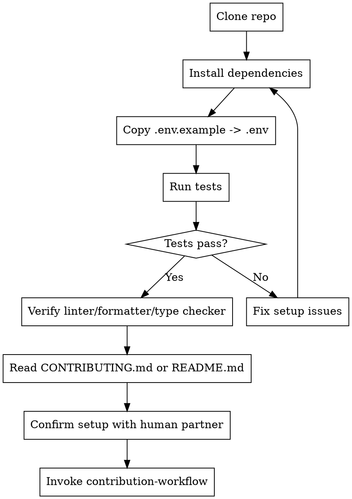

## Overview
Use a systematic setup process over ad-hoc guessing. Setup is complete only when tooling and baseline tests are confirmed.

<HARD-GATE>
Do NOT write code until setup is verified.
</HARD-GATE>

## Core Setup Checklist (TodoWrite)
- [ ] 1. Clone the repository
  - `git clone <repo-url>`
- [ ] 2. Install dependencies
  - `# replace with your package manager`
  - `npm install` or `pip install -r requirements.txt` or `pnpm install`
- [ ] 3. Copy environment config
  - `cp .env.example .env`
- [ ] 4. Run the test suite and verify baseline is green
  - `# replace with your project test command`
- [ ] 5. Verify tooling
  - `# replace with linter/formatter/type-check commands`
- [ ] 6. Read project guidance
  - `cat CONTRIBUTING.md` or `cat README.md`
- [ ] 7. Confirm setup with your human partner

## Common mistakes
- Skipping baseline tests before first code change
- Assuming local defaults instead of copying `.env.example`
- Ignoring formatter/type-checker configuration

## Red Flags
- "I'll set up tests later"
- "It works on my machine, that's enough"
- "I'll skip docs and just start coding"

## Next Skill
Invoke `contribution-workflow` after setup is confirmed.
